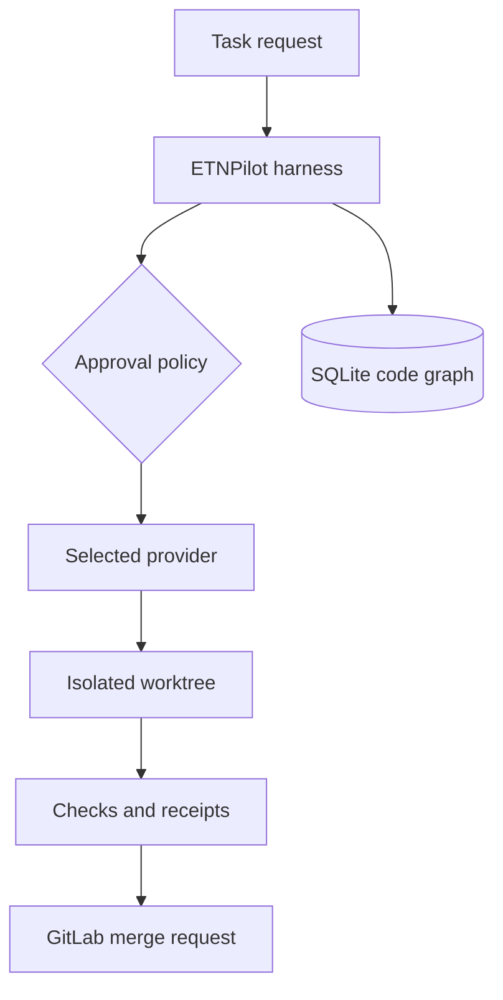

# Architecture

## Boundaries

| Area | Responsibility | Default implementation |
|---|---|---|
| Harness | Runs agents, subagents, plugins, events, approvals, receipts | `src/core/` |
| Providers | Capability-aware model/agent runtime adapters and safe fallback | GitHub Copilot SDK, OpenAI-compatible |
| Content | Instructions, skills, prompts, agent manifests | `.etnpilot/` |
| Git | Safe local operations and isolated branches | native Git worktrees |
| Forge | Remote repository lifecycle | self-hosted GitLab API |
| Code intelligence | Files, symbols, imports, impact queries | embedded SQLite code graph |
| Evidence | Tamper-evident run results | SHA-256 JSONL receipts |
| Workflow | Dependency ordering, retries, limits, cancellation | bounded DAG scheduler |
| Webhooks | Authenticated, deduplicated event intake | GitLab issue receiver and delivery store |

## Execution flow

Providers do not own orchestration policy. GitLab does not own local Git state. Plugins receive a
versioned, capability-scoped context and cannot silently replace an already registered component.
These boundaries keep the runtime testable and prevent a model provider from becoming the
architecture.

Provider selection combines agent preferences, matching routing rules, and configured defaults.
Each candidate must satisfy the required capability set. Fallback is intentionally conservative:
it only proceeds after a structured provider error declares the operation retryable and safe to
replay. This prevents duplicate file changes or tool calls after an ambiguous failure.

Plugin manifests declare their API version, version, dependencies, and required SDK capabilities.
All manifests are validated before setup, dependencies are topologically ordered, and setup code
can access only its declared registration and event APIs.

## Runnable workflow

`etnpilot run` loads the project's manifests, registers configured providers, and executes the configured DAG. The user chooses an isolated worktree or the current checkout through configuration or CLI flags. Agent steps receive the outputs of their dependencies. Check steps execute argument arrays directly without a shell. A failed dependency blocks downstream work. Cleanup is policy-driven and never removes a worktree with uncommitted changes. Publishing to GitLab requires the explicit `--publish` flag and a token supplied through the environment.

The code graph stores file fingerprints, extracted declarations, raw imports, and resolved project paths in SQLite. Indexing uses file metadata and hashes to update only changed or deleted files. Reverse traversal reports direct and transitive consumers with their depth and highlights test files. Workflow receipts include the graph state before and after execution plus impact evidence for changed source files.

## GitLab event intake

GitLab issue events pass through raw-body authentication, timestamp validation, project and label
filters, and an atomic delivery claim before entering the serialized workflow queue. The HTTP
receiver acknowledges accepted work before model execution. External commit statuses expose
running, successful, or failed outcomes in GitLab; a transient status-update conflict is retried.
Webhook execution reuses the same workflow, worktree, approval, receipt, provider-routing, and
publishing boundaries as an interactive run.

## Security defaults

- read-only actions may be approved by policy;
- writes, shell execution, and network access require a human decision;
- subprocesses use argument arrays with `shell: false`;
- worktrees are confined to `.etnpilot/worktrees/`;
- secrets come from environment variables or a future secret-provider plugin;
- receipts contain execution metadata, but should never include raw credentials.
- webhook signing secrets and API tokens are read from the environment and never persisted.
