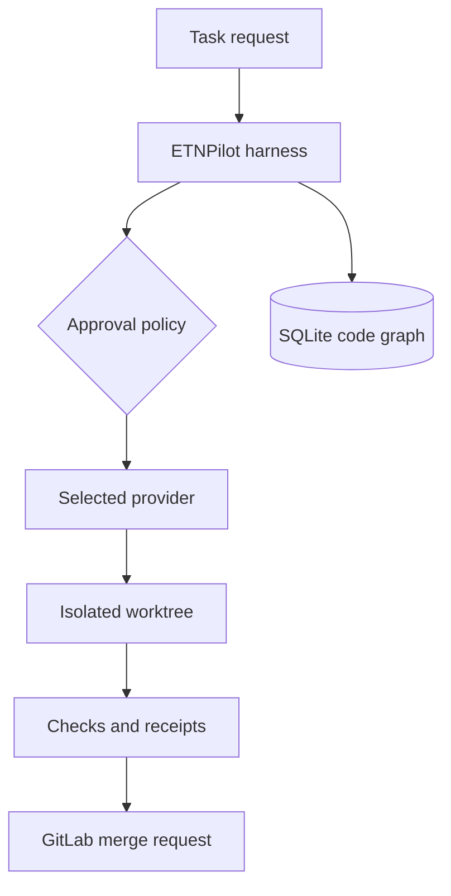

# Architecture

## Boundaries

| Area | Responsibility | Default implementation |
|---|---|---|
| Harness | Runs agents, subagents, plugins, events, approvals, receipts | `src/core/` |
| Providers | Model/agent runtime adapters | GitHub Copilot SDK, OpenAI-compatible |
| Content | Instructions, skills, prompts, agent manifests | `.etnpilot/` |
| Git | Safe local operations and isolated branches | native Git worktrees |
| Forge | Remote repository lifecycle | self-hosted GitLab API |
| Code intelligence | Files, symbols, imports, impact queries | embedded SQLite code graph |
| Evidence | Tamper-evident run results | SHA-256 JSONL receipts |
| Workflow | Dependency ordering, retries, limits, cancellation | bounded DAG scheduler |

## Execution flow

Providers do not own orchestration policy. GitLab does not own local Git state. Plugins receive the harness API but cannot silently replace an already registered capability. These boundaries keep the runtime testable and prevent a model provider from becoming the architecture.

## Runnable workflow

`etnpilot run` loads the project's manifests, registers configured providers, and executes the configured DAG. The user chooses an isolated worktree or the current checkout through configuration or CLI flags. Agent steps receive the outputs of their dependencies. Check steps execute argument arrays directly without a shell. A failed dependency blocks downstream work. Cleanup is policy-driven and never removes a worktree with uncommitted changes. Publishing to GitLab requires the explicit `--publish` flag and a token supplied through the environment.

## Security defaults

- read-only actions may be approved by policy;
- writes, shell execution, and network access require a human decision;
- subprocesses use argument arrays with `shell: false`;
- worktrees are confined to `.etnpilot/worktrees/`;
- secrets come from environment variables or a future secret-provider plugin;
- receipts contain execution metadata, but should never include raw credentials.
